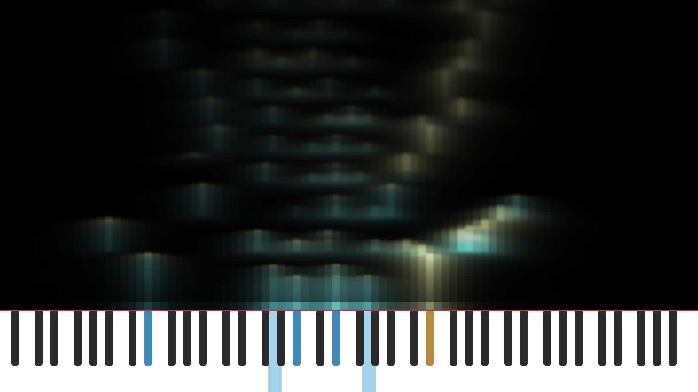

# Luminote

## Demo
https://yori-mirano.github.io/luminote/luminote.html

## Preview

### Slide up mode

### Skylines mode

## Usage
Open `dist/luminote.html` in a browser.

## Dev
### Requirements
- nodejs v18

### Watching changes
`npm start` and open `http://localhost:8080/luminote.html`

### Build
`npm run build` generate the `dist/luminote.html` file and the API doc in the `dist/docs` directory.

### Doc
https://yori-mirano.github.io/luminote/docs/modules.html
